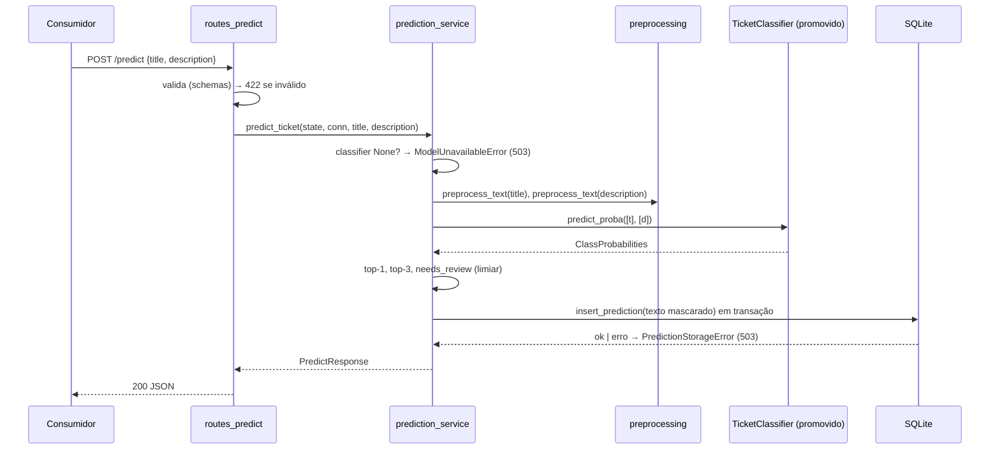

# Plano Técnico — Intelligent Support Ticket Classifier

## 1. Resumo Executivo

O repositório é greenfield (só um commit vazio em `develop`). O plano cria um
pacote Python 3.12 (`src/ticket_classifier`) gerenciado por `uv`, com quatro
blocos: (1) pipeline de dados que transforma o dataset público
`Tobi-Bueck/customer-support-tickets` em splits `train`/`validation`/`test`
mascarados e rotulados; (2) treino e avaliação de um Baseline TF-IDF +
Logistic Regression e de um Transformer (`distilbert-base-uncased` com duas
cabeças, `category` e `priority`), com registro de Versões de modelo,
rastreamento em MLflow local e relatório comparativo `PASS`/`FAIL`; (3) API
FastAPI (`POST /predict`, `POST /feedback`, `GET /health`) que serve a Versão
promovida e grava Previsões e Feedbacks em SQLite; (4) operação: expurgo
automático de 90 dias, retreino manual com gate de promoção e imagem Docker
só-CPU.

Tudo é operado por uma CLI única (`ticket-classifier <comando>`). O treino
real do Transformer é um comando manual, fora dos gates. A suíte automatizada
roda em CPU, sem internet e sem baixar modelo: os testes geram um BERT
minúsculo local (config com 1 camada, vocabulário de fixture) e um dataset de
amostra sintético em memória (DA-9).

Impacto: nada existente a preservar. Os pontos sensíveis são o dado pessoal
residual no texto gravado (AS-3), a regra de retenção de 90 dias (AS-5), a
chave de API do `/feedback` (AS-1, AS-7), os endpoints públicos (AS-6) e o
primeiro acesso ao Hugging Face Hub no treino (AS-8).

## 2. Premissas e Lacunas

### 2.1 Decidido pelo humano (de `decisions.md`)

| ID | Decisão | Consequência no plano |
|---|---|---|
| LAC-01 | Dataset público real (Kaggle/HF "Customer IT Support Ticket") | Fonte fixada: arquivo `dataset-tickets-multi-lang-4-20k.csv` do dataset HF `Tobi-Bueck/customer-support-tickets`, revisão `ddf1c81a5475992c4fa6752bf1e8b4e31f07bbeb` (DA-3). Download manual documentado no README |
| LAC-02 | Categorias `access`, `infrastructure`, `billing`, `bug`, `other` | `labels.CATEGORIES` (CT-1); Tabela de mapeamento (DA-4) |
| LAC-03 | Prioridades `low`, `medium`, `high` | `labels.PRIORITIES` (CT-1) |
| LAC-04 | Só inglês | Filtro pela coluna `language == "en"` do dataset (DA-5) |
| LAC-06 | Classe prevista + `needs_review` abaixo do limiar (default 0.6) | `Settings.review_threshold` (CT-4); regra em `prediction_service` (CT-24) |
| LAC-07 | `/predict` devolve `prediction_id` e grava; `/feedback` recebe `prediction_id` + rótulos | Tabelas `predictions` e `feedback` com FK (seção 7) |
| LAC-08 | Chave de API só no `/feedback` | Cabeçalho `X-API-Key`, `api/security.py` (CT-25) |
| LAC-09 | Mascarar PII em treino e inferência; persistir só texto mascarado | `preprocessing.preprocess_text` (CT-5) usado no prepare e no predict |
| LAC-10 | Disparo manual; promoção automática se não piorar | Comando `retrain` (CT-27) |
| LAC-11 | API serve a versão promovida no registro | `registry.json` com status `promoted` (CT-11) |
| LAC-12 | title 1-200, description 1-5000, truncamento de tokens | Validação em `api/schemas.py` (CT-22); truncamento no tokenizer (CT-13) |
| LAC-13 | Top-3 categorias com probabilidade | Campo `top_categories` (8.1) |
| LAC-16 | Sem equipe de destino | Nada construído |
| LAC-17 | Guarda todos os Feedbacks; retreino usa o mais recente | Feedback append-only; `list_current_feedback` (CT-20) |
| LAC-18 | E-mail, URL, telefone, 6+ dígitos | Regras de máscara (DA-6) |
| LAC-19 | Expurgo de Previsões sem Feedback após 90 dias | `storage/purge.py` (CT-21) + agendador (CT-26) |
| LAC-20 | Sem chave configurada: `/feedback` 401 sempre | Falha fechada em `require_api_key` (CT-25) + log de inicialização |
| LAC-21 | Sem versão promovida: API sobe, 503 em `/health` e `/predict` | `AppState.classifier = None` (CT-23) |
| LAC-22 | `needs_review` se category OU priority abaixo do limiar | CT-24 |
| LAC-23 | Gate: Macro F1 category >= e priority >= | CT-27 |
| LAC-24 | Nova versão servida no próximo reinício | Carga única no lifespan (CT-23) |
| LAC-25 | Retreino sem Feedback aborta | `NoFeedbackError` (CT-27) |
| LAC-26 | >= 100 exemplos por categoria no train | `min_train_examples_per_category` (CT-6, CT-9) |
| LAC-27 | Remover duplicatas exatas antes da divisão | Passo de dedup no prepare (DA-5) |
| LAC-28 | Baseline idêntico; Transformer <= 1 pp | Determinismo (DA-8) |
| LAC-29 | Falha ao gravar Previsão → 503 | `PredictionStorageError` (CT-24) |
| LAC-30 | Retreino concorrente recusado | Lock de arquivo `retrain.lock` (CT-27) |
| LAC-32 | A: `queue` + tags com regras ordenadas em TOML; DATA-91 vale para `queue` e `priority` | Formato de `configs/label_mapping.toml` (DA-4, seção 7.5); TASK-007 |

### 2.2 Premissas assumidas (lacunas não bloqueantes)

| ID | Premissa | Reversibilidade | Onde impacta |
|---|---|---|---|
| LAC-05 | PASS = Macro F1 category Transformer >= Baseline + 5 pp e Macro F1 priority Transformer >= Baseline | alta | `evaluation/report.py` (CT-17) |
| LAC-14 | 70/15/15 estratificado por category, semente fixa | alta | `configs/pipeline.toml`, `data/prepare.py` |
| LAC-15 | p95 <= 500 ms por ticket em CPU | alta | Escolha de DistilBERT e `max_length = 256` (DA-7); medida manual (seção 16) |
| LAC-31 | Textos exatos da seção 9 do spec | alta | Catálogo 8.3 |

### 2.3 Lacunas ainda abertas

Nenhuma. LAC-32 (regra de conversão de rótulos) foi decidida pelo humano: ver 2.1 e DA-4.

## 3. Ambiente e Comandos de Verificação

Repositório greenfield: nenhum comando existe hoje. Os comandos abaixo passam a
existir com o `pyproject.toml` criado pela TASK-001 (ferramentas confirmadas na
máquina: `uv 0.12.21` em `~/.local/bin/uv`, `Python 3.12.3`, `Docker 29.3.1`).
Formato JUnit conforme `setup-junit.md` (seção pytest).

| Alvo | Comando | Diretório | Relatório | Origem |
|---|---|---|---|---|
| Instalar dependências | `uv sync --all-extras` | `.` | — | `pyproject.toml` + `uv.lock` (TASK-001) |
| Lint | `uv run ruff check . --output-format=concise` | `.` | — | `pyproject.toml` `[tool.ruff]` (TASK-001) |
| Typecheck | `uv run mypy src` | `.` | — | `pyproject.toml` `[tool.mypy]` (TASK-001) |
| Teste (suíte) | `uv run pytest` | `.` | `reports/junit.xml` | `pyproject.toml` `[tool.pytest.ini_options]` addopts com `--junitxml=reports/junit.xml -m "not container"` (TASK-001) |
| Teste (relacionado a arquivo) | `uv run pytest {files}` | `.` | `reports/junit.xml` | idem |
| Build | `uv build --wheel --out-dir dist` | `.` | — | `pyproject.toml` `[build-system]` hatchling (TASK-001) |
| Subir ambiente local | `uv run uvicorn ticket_classifier.api.app:create_app --factory --host 127.0.0.1 --port 8000` | `.` | — | README (TASK-023) |
| Subir ambiente local (container) | `docker build -f docker/Dockerfile -t support-ticket-ai . && docker run --rm -p 8000:8000 -v "$(pwd)/artifacts:/app/artifacts:ro" -v "$(pwd)/var:/app/var" -e TICKET_API_KEY support-ticket-ai` | `.` | — | `docker/Dockerfile` + README (TASK-028) |
| URL da aplicação | `http://localhost:8000` | — | — | comando acima; OpenAPI em `/docs` |
| Credenciais QA | `TICKET_API_KEY` | — | — | variável de ambiente lida por `Settings` (CT-4); só o nome |
| Preparar dataset (manual) | `uv run ticket-classifier prepare` | `.` | — | CLI (TASK-009); exige `data/raw/tickets.csv` baixado |
| Treino real do Transformer (manual, fora dos gates) | `uv run ticket-classifier train-transformer` | `.` | — | CLI (TASK-016); baixa `distilbert-base-uncased` do HF Hub |
| Smoke do container (Gate da TASK-028) | `uv run pytest -m container tests/container/test_container_smoke.py` | `.` | `reports/junit.xml` | marcador `container` (TASK-001, TASK-028) |

Notas:
- Não há Playwright: projeto sem tela. Linhas e2e omitidas.
- A suíte padrão exclui o marcador `container` (Docker + rede). OPS-03 vale
  para a suíte padrão: `tests/conftest.py` força `HF_HUB_OFFLINE=1`,
  `TRANSFORMERS_OFFLINE=1` e `CUDA_VISIBLE_DEVICES=""`.
- Treino real, preparação real e smoke de container ficam fora do gate
  mecânico de onda.

## 4. Estratégia de Testes

Sem `TESTING.md` (greenfield). Convenção definida aqui:

| Camada / pasta | Tipo exigido | Paralelo-seguro |
|---|---|---|
| `tests/unit` | unit | sim |
| `tests/integration` | integration | sim |
| `tests/support` | unit | sim |
| `tests/container` | e2e | não |

- `tests/unit`: funções puras e módulos com I/O em `tmp_path` (SQLite, JSON,
  TOML). Sem rede, sem modelo baixado.
- `tests/integration`: fluxos multi-módulo (prepare completo, treino com modelo
  minúsculo, API via `fastapi.testclient.TestClient` em processo). Tudo em
  `tmp_path`; nenhuma porta aberta; MLflow com
  `MLFLOW_TRACKING_URI=sqlite:///<tmp_path>/mlflow.db`. Por isso paralelo-seguro.
- `tests/support`: helpers de teste (não são testes): `sample_data.py`
  (gerador determinístico de tickets no formato do CSV de origem) e
  `tiny_model.py` (cria BERT minúsculo local em `tmp_path`).
- `tests/container`: `docker build` + `docker run` em porta fixa 18080.
  Marcador `container`, excluído da suíte padrão.
- Co-location: a task que cria o código escreve o teste dele.

## 5. Arquitetura Proposta

### 5.1 Visão de Componentes

```
src/ticket_classifier/
  __init__.py              versão do pacote
  cli.py                   CLI argparse: prepare, train-baseline, train-transformer,
                           compare, analyze-errors, list-versions, retrain, purge
  labels.py                conjuntos fechados (CT-1)
  errors.py                PipelineError (CT-2)
  settings.py              Settings de ambiente TICKET_* (CT-4)
  preprocessing.py         normalização + máscara de PII (CT-5)
  pipeline_config.py       leitura de configs/pipeline.toml (CT-6)
  registry.py              registro de Versões de modelo (CT-11)
  tracking.py              MLflow (CT-15) — só treino
  training.py              treina, avalia, salva, registra (CT-16) — só treino
  retraining.py            retreino com feedback + gate (CT-27)
  data/label_mapping.py    Tabela de mapeamento (CT-7)
  data/splits.py           gravação/leitura dos splits (CT-8)
  data/prepare.py          preparação do dataset (CT-9)
  models/base.py           protocolo TicketClassifier (CT-3)
  models/baseline.py       TF-IDF + LR (CT-12)
  models/transformer.py    encoder + 2 cabeças (CT-13)
  models/transformer_training.py  loop de fine-tuning (CT-14)
  models/loader.py         carrega classificador de uma versão (CT-16)
  evaluation/metrics.py    métricas (CT-10)
  evaluation/report.py     relatório comparativo (CT-17)
  evaluation/error_analysis.py  análise de erros (CT-18)
  storage/database.py      conexão/esquema SQLite (CT-19)
  storage/predictions.py   repositório de Previsões (CT-19)
  storage/feedback.py      repositório de Feedbacks (CT-20)
  storage/purge.py         expurgo (CT-21)
  services/prediction_service.py  regra do /predict (CT-24)
  api/schemas.py, api/errors.py   modelos e erros HTTP (CT-22)
  api/app.py               create_app + lifespan (CT-23)
  api/routes_health.py, api/routes_predict.py, api/routes_feedback.py
  api/security.py          chave de API (CT-25)
  api/purge_scheduler.py   expurgo periódico (CT-26)
configs/pipeline.toml, configs/label_mapping.toml
docker/Dockerfile, docker/Dockerfile.dockerignore, README.md
```

Fronteira de importação: `api/*`, `services/*`, `storage/*`, `models/loader.py`
e `registry.py` **não** importam `training`, `tracking`, `retraining` nem
`mlflow` (a imagem Docker não instala o extra `train`).

Layout de dados em disco (todos no `.gitignore`):
- `data/raw/tickets.csv` — CSV de origem baixado manualmente.
- `data/processed/{train,validation,test}.jsonl` + `prepare_report.json`.
- `artifacts/registry.json`, `artifacts/registry.lock`, `artifacts/retrain.lock`,
  `artifacts/models/<version_id>/`, `artifacts/reports/`.
- `var/tickets.db` — SQLite de Previsões e Feedbacks.
- `mlflow.db` + `mlartifacts/` — MLflow local (default do URI).

### 5.2 Fluxo Principal



Fluxo de treino: `prepare` → `train-baseline` / `train-transformer`
(`training.train_and_register`: carrega splits → treina com train, seleciona
com validation → avalia validation e test → salva em
`artifacts/models/<id>/` → MLflow → registra → promove o 1º transformer) →
`compare` → `analyze-errors`. Retreino: `retrain` (lock → feedback vigente →
`train_and_register` com `extra_train` → gate no Test set congelado →
promove ou não).

### 5.3 Decisões Arquiteturais

| # | Decisão | Alternativas rejeitadas | Por quê |
|---|---|---|---|
| DA-1 | Python 3.12 + `uv` (lockfile `uv.lock`), layout `src/`, build hatchling | pip + requirements.txt; Poetry | `uv` já instalado; lock reprodutível; Ubuntu 24.04 bloqueia `pip install` no Python do sistema (PEP 668) |
| DA-2 | `torch` só-CPU pelo índice `https://download.pytorch.org/whl/cpu` via `[tool.uv.sources]` + `[[tool.uv.index]]` `explicit = true` | torch padrão do PyPI (com CUDA) | Instalação e imagem Docker menores; requisito é CPU |
| DA-3 | Fonte: `dataset-tickets-multi-lang-4-20k.csv` (HF `Tobi-Bueck/customer-support-tickets`, revisão `ddf1c81a5475992c4fa6752bf1e8b4e31f07bbeb`, SHA-256 `9be3bf810584fe01e8e83383e83dfd33f4c3910938ecad03ef151da79d8f0635`, licença CC BY-NC 4.0), salvo em `data/raw/tickets.csv`. Download manual por `curl` (README), sem código de download | arquivo `aa_dataset-tickets-multi-lang-5-2-50-version.csv`; config HF completa | Medido: 11.923 linhas `en`, prioridades só `low/medium/high`, e 446 tickets de acesso contra 195 no outro arquivo (margem para DATA-10). Sem código de download = sem integração nova em runtime |
| DA-4 | (LAC-32 = A) Tabela de mapeamento TOML com (a) `[priority]` cobrindo todo valor de `priority` (falta → DATA-91); (b) `[category.queue]` cobrindo toda `queue` (falta → DATA-91) como categoria padrão; (c) `[[category.rules]]` ordenadas, primeira que casar vence, por `queue_in` ou `any_tag_in` sobre `tag_1..tag_8`; tags fora das regras são ignoradas | mapear só `queue` (zera `access` e `bug`); exigir toda tag (>1000 valores) na tabela | Simulação no arquivo de DA-3 após filtros: other 4770, bug 3137, infrastructure 1343, billing 1194, access 446 (train ≈ 312 access) |
| DA-5 | Ordem do prepare: ler CSV → filtrar `language == "en"` (motivo `non_english`) → decodificar a sequência literal `\n` (2 caracteres) do CSV em espaço → `preprocess_text` em title/description → descartar vazio (`empty_text`) → mapear rótulos → dedup por (title, description) mantendo a 1ª (`duplicate`) → split estratificado → checar mínimo de 100 no train → gravar. Toda validação ocorre antes de gravar | detector de idioma (`langdetect`) | Coluna `language` do dataset é determinística; 257 corpos `en` trazem `\n` literal |
| DA-6 | Máscara de PII (ordem fixa): EMAIL → URL → PHONE → NUMBER. EMAIL: `local@dominio.tld`. URL: começa com `http://`, `https://` ou `www.` até o próximo espaço. PHONE: `+` opcional seguido de 8 a 15 dígitos agrupados com espaço, `.`, `-` ou parênteses, contendo ao menos um separador ou o `+` inicial. NUMBER: qualquer sequência restante de 6+ dígitos seguidos. Normalização antes da máscara: caracteres Unicode de controle (categoria `Cc`) viram espaço, sequências de espaço colapsam em um, pontas removidas. Caixa preservada | NER; mascarar só depois de normalizar em minúsculas | LAC-18; mesma rotina no treino e na inferência (DATA-08) |
| DA-7 | Transformer: `distilbert-base-uncased` com encoder compartilhado e duas cabeças lineares sobre o token `[CLS]`; entrada como par (title, description), `truncation="longest_first"`, `max_length = 256` | dois modelos separados; `bert-base` | Uma passada por ticket (latência p95 <= 500 ms em CPU); DistilBERT é ~40% menor que BERT-base |
| DA-8 | Determinismo: semente única `seed` em `configs/pipeline.toml` aplicada a `random`, `numpy`, `torch.manual_seed`, `torch.use_deterministic_algorithms(True)`, `torch.set_num_threads(num_threads)` e ao gerador do DataLoader; LR com `random_state=seed`; split com `random_state=seed` | sem controle de threads | MODEL-06 / LAC-28 |
| DA-9 | Testes sem rede: `tests/support/tiny_model.py` cria em `tmp_path` um `BertModel` com `BertConfig(hidden_size=32, num_hidden_layers=1, num_attention_heads=2, intermediate_size=64)` e `BertTokenizerFast` com vocabulário de fixture; `tests/support/sample_data.py` gera CSV de origem sintético determinístico (>= 150 linhas por categoria, linhas em alemão, duplicatas, textos vazios, PII) | baixar `prajjwal1/bert-tiny` nos testes | OPS-03; suíte rápida em CPU |
| DA-10 | Registro de versões próprio em `artifacts/registry.json` (escrita com `fcntl.flock` em `registry.lock` + arquivo temporário + `os.replace`; leitura sem lock) + MLflow só como rastreamento de experimentos | MLflow Model Registry como fonte da versão promovida | API não depende de MLflow; imagem menor; invariante de 1 promovida testável |
| DA-11 | Persistência SQLite (stdlib `sqlite3`), WAL, `foreign_keys=ON`, conexão por requisição, transações `BEGIN IMMEDIATE` | PostgreSQL; SQLAlchemy | Escala de demo; FK garante "nunca Feedback sem Previsão" (OPS-90); sem serviço extra |
| DA-12 | Rotas síncronas (`def`) no FastAPI (threadpool); inferência serializada por `threading.Lock` dentro do classificador | `async def` com `run_in_executor` | Simples; API-95 garantido por `uuid4` e transação por requisição |
| DA-13 | `/feedback` lê o corpo manualmente (`Request`), valida a chave antes de parsear o JSON e só então valida com `FeedbackRequest.model_validate_json`; schema publicado via `openapi_extra` | `Depends` no router | FastAPI parseia JSON antes das dependências; sem isso corpo não-JSON sem chave daria 422 em vez de 401 (FDBK-90) |
| DA-14 | Expurgo automático como tarefa `asyncio` iniciada no lifespan (roda na subida e a cada `TICKET_PURGE_INTERVAL_SECONDS`, default 86400), executando o SQL em `asyncio.to_thread` | cron externo; APScheduler | OPS-08 sem dependência nova nem processo extra |
| DA-15 | Lock de retreino: `fcntl.flock(LOCK_EX \| LOCK_NB)` em `artifacts/retrain.lock` | arquivo sentinela | Liberado pelo SO se o processo morre (RETR-91/92) |
| DA-16 | Desbalanceamento: `class_weight="balanced"` no LR; cross-entropy ponderada pelo inverso da frequência no train no Transformer; seleção de checkpoint pela média dos Macro F1 de validation (category, priority) | sem ponderação | Métrica principal é Macro F1 |
| DA-17 | CLI com `argparse` (stdlib) e subcomandos; erros de domínio são `PipelineError`: mensagem em stderr e código de saída 1 | Typer/Click | Sem dependência nova |

## 6. Reuso Obrigatório

Greenfield: não há código a reaproveitar. O reuso obrigatório é das
bibliotecas e dos módulos criados pelas primeiras tasks:

| Precisa de | Já existe em | Como usar |
|---|---|---|
| Conjuntos de rótulos | `src/ticket_classifier/labels.py` (TASK-002) | importar `CATEGORIES`, `PRIORITIES`, `Category`, `Priority`; nunca redefinir listas |
| Erro de domínio da CLI | `src/ticket_classifier/errors.py` (TASK-002) | subclassificar `PipelineError`; a CLI converte em stderr + exit 1 |
| Pré-processamento/máscara | `src/ticket_classifier/preprocessing.py` (TASK-005) | `preprocess_text` no prepare e no predict; nunca reimplementar regex |
| Configuração de ambiente | `src/ticket_classifier/settings.py` (TASK-004) | `get_settings()`; nunca ler `os.environ` direto |
| Configuração de pipeline | `src/ticket_classifier/pipeline_config.py` (TASK-006) | `load_pipeline_config(path)` |
| Métricas | `src/ticket_classifier/evaluation/metrics.py` (TASK-010) | `compute_target_metrics`, `evaluate_classifier` |
| Versões de modelo | `src/ticket_classifier/registry.py` (TASK-011) | `ModelRegistry(settings.artifacts_dir)` |
| Carga de classificador | `src/ticket_classifier/models/loader.py` (TASK-016) | `load_classifier(version, artifacts_dir)` |
| Transações SQLite | `src/ticket_classifier/storage/database.py` (TASK-019) | `connect`, `transaction` |
| Formato de erro HTTP | `src/ticket_classifier/api/errors.py` (TASK-022) | `error_response`, `validation_message` |
| Registro de subcomando | `src/ticket_classifier/cli.py` (TASK-001) | padrão `_add_<nome>_command(subparsers)` com `set_defaults(handler=...)` |
| TF-IDF + LR | scikit-learn | `Pipeline(TfidfVectorizer, LogisticRegression)`; métricas `precision_recall_fscore_support`, `confusion_matrix`, `accuracy_score`; split `train_test_split(stratify=...)` |
| Encoder e tokenizer | transformers | `AutoModel.from_pretrained`, `AutoTokenizer.from_pretrained`, `get_linear_schedule_with_warmup`, `save_pretrained` |
| Configuração tipada | pydantic-settings | `BaseSettings` com `env_prefix="TICKET_"`, `SecretStr` |
| Cliente HTTP de teste | fastapi | `fastapi.testclient.TestClient` (requer `httpx`) |
| Rastreamento | mlflow | `mlflow.set_tracking_uri`, `set_experiment`, `start_run`, `log_params`, `log_metrics`, `log_dict`, `log_artifacts` |

## 7. Modelos de Dados

### 7.1 SQLite (`var/tickets.db`, criado por `init_schema`, idempotente)

Tabela `predictions` (contém dado pessoal residual: nomes não mascarados):

| Campo | Tipo | Obrig. | Notas |
|---|---|---|---|
| `prediction_id` | TEXT PK | sim | `uuid4` em texto |
| `title_masked` | TEXT | sim | **PII residual** — já passou por `preprocess_text` |
| `description_masked` | TEXT | sim | **PII residual** |
| `category` | TEXT | sim | CHECK em `CATEGORIES` |
| `category_confidence` | REAL | sim | 0..1 |
| `priority` | TEXT | sim | CHECK em `PRIORITIES` |
| `priority_confidence` | REAL | sim | 0..1 |
| `needs_review` | INTEGER | sim | 0/1 |
| `model_version` | TEXT | sim | `version_id` servido |
| `created_at` | TEXT | sim | ISO 8601 UTC com microssegundos e `+00:00` (formato fixo, ordenável como texto) |

Índice: `idx_predictions_created_at(created_at)`.

Tabela `feedback` (append-only):

| Campo | Tipo | Obrig. | Notas |
|---|---|---|---|
| `seq` | INTEGER PK AUTOINCREMENT | sim | desempate de ordem |
| `feedback_id` | TEXT UNIQUE | sim | `uuid4` |
| `prediction_id` | TEXT | sim | FK → `predictions.prediction_id` `ON DELETE RESTRICT` |
| `category` | TEXT | sim | CHECK em `CATEGORIES` |
| `priority` | TEXT | sim | CHECK em `PRIORITIES` |
| `received_at` | TEXT | sim | ISO 8601 UTC, mesmo formato |

Índice: `idx_feedback_prediction(prediction_id, received_at, seq)`.
Feedback vigente: maior `(received_at, seq)` por `prediction_id`.

### 7.2 Splits (`data/processed/`)

- `train.jsonl`, `validation.jsonl`, `test.jsonl`: uma linha JSON por registro
  `{"title": str, "description": str, "category": str, "priority": str}`
  (texto já pré-processado e mascarado), `ensure_ascii=False`, ordem fixa.
- `prepare_report.json`: `source_path`, `source_sha256`, `seed`,
  `total_source_rows`, `discarded` (`non_english`, `empty_text`,
  `duplicate`), `splits.<nome>.total`, `splits.<nome>.category.<rótulo>`,
  `splits.<nome>.priority.<rótulo>`, `splits_version`.
- `splits_version`: 12 primeiros hex do SHA-256 dos bytes de `train.jsonl`,
  `validation.jsonl` e `test.jsonl` concatenados nessa ordem.

### 7.3 Registro de versões (`artifacts/registry.json`)

`{"versions": [ModelVersion, ...]}`. `ModelVersion`:
`version_id` (`<kind>-<YYYYMMDDTHHMMSSZ>-<8 hex>`), `kind`
(`baseline`|`transformer`), `status` (`registered`|`promoted`|`retired`),
`created_at` (ISO 8601 UTC), `splits_version`, `seed`, `hyperparameters`
(objeto), `metrics` (`{"validation": {"category": TargetMetrics, "priority":
TargetMetrics}, "test": {...}}`), `training_rows` (int), `feedback_rows`
(int, 0 fora do retreino), `artifact_dir` (relativo a `artifacts/`).
Invariante: no máximo uma `promoted`. Transições: seção 7 do spec.

### 7.4 Artefatos de modelo (`artifacts/models/<version_id>/`)

- baseline: `category.joblib`, `priority.joblib`, `baseline_meta.json`.
- transformer: `encoder/` (`save_pretrained`), `tokenizer/`, `heads.pt`
  (state dict das duas cabeças, carregado com `weights_only=True`),
  `transformer_meta.json` (`max_length`, `categories`, `priorities`).
- `joblib` usa pickle: só carregar artefatos gerados localmente pelo pipeline.

### 7.5 Arquivos de configuração

`configs/pipeline.toml`:

```toml
seed = 42
[data]
source_path = "data/raw/tickets.csv"
processed_dir = "data/processed"
title_column = "subject"
description_column = "body"
language_column = "language"
language = "en"
queue_column = "queue"
priority_column = "priority"
tag_columns = ["tag_1", "tag_2", "tag_3", "tag_4", "tag_5", "tag_6", "tag_7", "tag_8"]
train_ratio = 0.70
validation_ratio = 0.15
test_ratio = 0.15
min_train_examples_per_category = 100
[baseline]
c_grid = [0.1, 1.0, 10.0]
ngram_max = 2
min_df = 2
max_features = 50000
[transformer]
model_name = "distilbert-base-uncased"
max_length = 256
epochs = 3
batch_size = 16
learning_rate = 5e-5
weight_decay = 0.01
warmup_ratio = 0.1
num_threads = 4
```

`configs/label_mapping.toml` — formato decidido em LAC-32 (DA-4):

```toml
version = "1"
[priority]            # todo valor de origem precisa estar aqui (DATA-91)
low = "low"
medium = "medium"
high = "high"
very_low = "low"
critical = "high"
[category.queue]      # toda queue de origem precisa estar aqui (DATA-91)
"Billing and Payments" = "billing"
"Service Outages and Maintenance" = "infrastructure"
"Technical Support" = "other"
"Product Support" = "other"
"Customer Service" = "other"
"IT Support" = "other"
"Returns and Exchanges" = "other"
"Sales and Pre-Sales" = "other"
"Human Resources" = "other"
"General Inquiry" = "other"
[[category.rules]]    # ordem importa; a primeira que casar vence; depois cai em [category.queue]
name = "billing-queue"
queue_in = ["Billing and Payments"]
category = "billing"
[[category.rules]]
name = "access-tags"
any_tag_in = ["Login", "Account", "Access", "Password", "Authentication"]
category = "access"
[[category.rules]]
name = "outage-queue"
queue_in = ["Service Outages and Maintenance"]
category = "infrastructure"
[[category.rules]]
name = "bug-tags"
any_tag_in = ["Bug", "Crash"]
category = "bug"
[[category.rules]]
name = "infrastructure-tags"
any_tag_in = ["Outage", "Network", "Hardware", "Server", "Disruption"]
category = "infrastructure"
```

Toda categoria/prioridade de destino precisa pertencer a `CATEGORIES` /
`PRIORITIES`; senão a carga da tabela falha.

## 8. Contratos

### 8.1 Contratos externos (API)

Formato de erro comum (todas as respostas 401/404/422/503 exceto `/health`):
`{"code": "<CODIGO>", "message": "<texto da seção 8.3>"}`.

**POST /predict** — sem autenticação.

Request (`application/json`):
```json
{"title": "string, 1..200 chars após strip", "description": "string, 1..5000 chars após strip"}
```
Campos extras são ignorados. Tipos estritos (número, `null`, lista → corpo inválido).

Response 200:
```json
{
  "prediction_id": "uuid4",
  "category": "access|infrastructure|billing|bug|other",
  "category_confidence": 0.0,
  "priority": "low|medium|high",
  "priority_confidence": 0.0,
  "top_categories": [{"category": "...", "probability": 0.0}, {"...": "..."}, {"...": "..."}],
  "needs_review": false,
  "model_version": "transformer-20261001T120000Z-1a2b3c4d"
}
```
- `top_categories`: 3 itens distintos, probabilidade decrescente, empate
  desempatado pela ordem de `CATEGORIES`; `top_categories[0].category ==
  category` e `top_categories[0].probability == category_confidence` (mesmo
  float, sem arredondamento).
- `needs_review = category_confidence < limiar or priority_confidence < limiar`.

Status: 200; 422 (`VALIDATION_ERROR`); 503 (`MODEL_UNAVAILABLE`,
`STORAGE_UNAVAILABLE`). Validação: o primeiro erro encontrado na ordem
corpo → `title` → `description` define a mensagem. Por campo: ausente →
required; tipo não-texto → corpo inválido; vazio após strip → blank; acima do
máximo após strip → between.

**POST /feedback** — cabeçalho `X-API-Key` obrigatório.

Request:
```json
{"prediction_id": "string", "category": "access|infrastructure|billing|bug|other", "priority": "low|medium|high"}
```
Response 201:
```json
{"feedback_id": "uuid4", "prediction_id": "...", "category": "...", "priority": "...", "received_at": "2026-10-01T12:00:00.123456+00:00"}
```
Status e precedência: 401 (`UNAUTHORIZED`) > 422 (`VALIDATION_ERROR`) > 404
(`PREDICTION_NOT_FOUND`) > 503 (`STORAGE_UNAVAILABLE`). Ordem de validação:
corpo → `prediction_id` (ausente → required; não-texto → corpo inválido) →
`category` (ausente ou fora do conjunto → one-of) → `priority` (idem).

**GET /health** — sem autenticação.

- 200 `{"status": "ok", "model_version": "<version_id>"}`
- 503 `{"status": "unavailable", "model_version": null}`

Documentação interativa: `/docs` (OpenAPI gerado pelo FastAPI).

**CLI** (`uv run ticket-classifier <comando>`; exit 0 sucesso, 1
`PipelineError`, 2 uso inválido):

| Comando | Opções | Saída |
|---|---|---|
| `prepare` | `--config PATH` (default `configs/pipeline.toml`), `--mapping PATH` (default `configs/label_mapping.toml`) | splits + `prepare_report.json`; resumo em stdout |
| `train-baseline` | `--config PATH` | `Registered model version '<id>' (baseline). Promoted: no.` |
| `train-transformer` | `--config PATH` | `Registered model version '<id>' (transformer). Promoted: yes\|no.` |
| `compare` | `--baseline ID`, `--transformer ID` (default: mais recente de cada tipo) | `artifacts/reports/comparison.{md,json}`; stdout com tabela e `Verdict: PASS\|FAIL` (exit 0 nos dois) |
| `analyze-errors` | `--version ID` (default: promovida) | `artifacts/reports/error_analysis_<id>.{md,json}` |
| `list-versions` | — | tabela: `version_id`, `kind`, test category macro F1, test priority macro F1, `created_at`, `promoted` (`yes`/`no`) |
| `retrain` | `--config PATH` | mensagem RETR-04 + métricas nova × promovida |
| `purge` | — | mensagem OPS-08 |

### 8.2 Contratos internos entre tasks

Caminhos relativos a `src/ticket_classifier/`.

| ID | Contrato (assinatura / rota / tipo) | Produzido por | Consumido por |
|---|---|---|---|
| CT-1 | `labels.py`: `CATEGORIES: tuple[str, ...] = ("access", "infrastructure", "billing", "bug", "other")`; `PRIORITIES: tuple[str, ...] = ("low", "medium", "high")`; `Category = Literal["access", "infrastructure", "billing", "bug", "other"]`; `Priority = Literal["low", "medium", "high"]`; `TARGETS: tuple[str, str] = ("category", "priority")` | TASK-002 | TASK-003, 007, 010, 012, 013, 019, 022, 024 |
| CT-2 | `errors.py`: `class PipelineError(Exception)` com `__init__(self, message: str) -> None` e atributo `message: str` | TASK-002 | TASK-006, 007, 008, 009, 011, 016, 017, 018, 027 |
| CT-3 | `models/base.py`: `@dataclass(frozen=True) class ClassProbabilities: category: dict[str, float]; priority: dict[str, float]` (chaves = todos os rótulos, soma ≈ 1); `class TicketClassifier(Protocol): kind: Literal["baseline", "transformer"]; def predict_proba(self, titles: Sequence[str], descriptions: Sequence[str]) -> list[ClassProbabilities]; def save(self, directory: Path) -> None`; `def top_label(probs: Mapping[str, float], order: Sequence[str]) -> tuple[str, float]` (argmax; empate pela ordem de `order`) | TASK-003 | TASK-010, 012, 013, 016, 018, 023, 024 |
| CT-4 | `settings.py`: `class Settings(BaseSettings)` com `env_prefix="TICKET_"`: `api_key: SecretStr \| None = None` (string vazia → `None`), `review_threshold: float = Field(0.6, ge=0.0, le=1.0)`, `db_path: Path = Path("var/tickets.db")`, `artifacts_dir: Path = Path("artifacts")`, `retention_days: int = Field(90, ge=1)`, `purge_interval_seconds: int = Field(86400, ge=1)`; `def get_settings() -> Settings` (instância nova a cada chamada) | TASK-004 | TASK-016, 018, 021, 023, 024, 025, 026, 027 |
| CT-5 | `preprocessing.py`: `def normalize_text(text: str) -> str`; `def mask_pii(text: str) -> str`; `def preprocess_text(text: str) -> str` (= `mask_pii(normalize_text(text))`, idempotente); marcadores `"[EMAIL]"`, `"[URL]"`, `"[PHONE]"`, `"[NUMBER]"` | TASK-005 | TASK-009, 024 |
| CT-6 | `pipeline_config.py`: `@dataclass(frozen=True)` `DataConfig`, `BaselineConfig`, `TransformerConfig`, `PipelineConfig(seed: int, data: DataConfig, baseline: BaselineConfig, transformer: TransformerConfig)` com os campos de `configs/pipeline.toml` (seção 7.5); `def load_pipeline_config(path: Path) -> PipelineConfig` (erro de chave ausente → `PipelineError`) | TASK-006 | TASK-009, 012, 014, 016, 027 |
| CT-7 | `data/label_mapping.py`: `class UnmappedLabelError(PipelineError)` (mensagem DATA-91); `@dataclass(frozen=True) class LabelMapping`; `def load_label_mapping(path: Path) -> LabelMapping`; `LabelMapping.map_category(self, queue: str, tags: Sequence[str]) -> str`; `LabelMapping.map_priority(self, source: str) -> str` | TASK-007 | TASK-009 |
| CT-8 | `data/splits.py`: `SPLIT_NAMES = ("train", "validation", "test")`; `class EmptySplitError(PipelineError)` (mensagem MODEL-90); `def write_splits(splits: Mapping[str, pd.DataFrame], report: dict[str, Any], out_dir: Path) -> str` (grava via diretório temporário + `os.replace`, devolve `splits_version`); `def load_split(data_dir: Path, name: str) -> pd.DataFrame` (colunas `title, description, category, priority`); `def splits_version(data_dir: Path) -> str` | TASK-008 | TASK-009, 016, 018, 027 |
| CT-9 | `data/prepare.py`: `class SourceDatasetNotFoundError(PipelineError)` (DATA-92); `class InsufficientExamplesError(PipelineError)` (DATA-10); `def prepare_dataset(config: PipelineConfig, mapping_path: Path) -> dict[str, Any]` (devolve o relatório de 7.2) | TASK-009 | TASK-016, 018, 027 (testes, via fixtures) |
| CT-10 | `evaluation/metrics.py`: `@dataclass class ClassMetrics(precision: float, recall: float, f1: float, support: int)`; `@dataclass class TargetMetrics(labels: list[str], accuracy: float, macro_f1: float, per_class: dict[str, ClassMetrics], confusion_matrix: list[list[int]])` com `to_dict() -> dict[str, Any]` e `@classmethod from_dict(data) -> TargetMetrics`; `def compute_target_metrics(y_true: Sequence[str], y_pred: Sequence[str], labels: Sequence[str]) -> TargetMetrics` (`zero_division=0`); `def evaluate_classifier(classifier: TicketClassifier, frame: pd.DataFrame) -> dict[str, TargetMetrics]` (chaves `category`, `priority`) | TASK-010 | TASK-014, 016, 017, 018 |
| CT-11 | `registry.py`: `@dataclass class ModelVersion` (campos de 7.3) com `to_dict`/`from_dict`; `class ModelRegistry(artifacts_dir: Path)`: `new_version_id(kind: str) -> str`, `model_dir(version_id: str) -> Path`, `register(version: ModelVersion) -> None`, `promote(version_id: str) -> None` (anterior → `retired`; alvo precisa estar `registered`, senão `PipelineError`), `get(version_id: str) -> ModelVersion`, `get_promoted() -> ModelVersion \| None`, `latest(kind: str) -> ModelVersion \| None`, `list_versions() -> list[ModelVersion]` (ordem `created_at`) | TASK-011 | TASK-015, 016, 017, 018, 023, 027 |
| CT-12 | `models/baseline.py`: `class BaselineClassifier` (implementa CT-3, `kind = "baseline"`) com `@classmethod load(directory: Path) -> BaselineClassifier`; `def train_baseline(train: pd.DataFrame, validation: pd.DataFrame, config: BaselineConfig, seed: int) -> tuple[BaselineClassifier, dict[str, Any]]` (dict = hiperparâmetros escolhidos por alvo) | TASK-012 | TASK-016 |
| CT-13 | `models/transformer.py`: `class TransformerClassifier` (implementa CT-3, `kind = "transformer"`) com `@classmethod from_pretrained(model_name_or_path: str, max_length: int, seed: int) -> TransformerClassifier`, `@classmethod load(directory: Path) -> TransformerClassifier`, atributos `module: torch.nn.Module`, `tokenizer`, `max_length: int`; `def encode(self, titles: Sequence[str], descriptions: Sequence[str]) -> BatchEncoding` (par, `truncation="longest_first"`, `max_length`) | TASK-013 | TASK-014, 016 |
| CT-14 | `models/transformer_training.py`: `def set_determinism(seed: int, num_threads: int) -> None`; `def train_transformer(train: pd.DataFrame, validation: pd.DataFrame, config: TransformerConfig, seed: int) -> tuple[TransformerClassifier, dict[str, Any]]` (dict = hiperparâmetros + `best_epoch`) | TASK-014 | TASK-016 |
| CT-15 | `tracking.py`: `def log_training_run(version: ModelVersion, model_dir: Path, experiment_name: str = "support-ticket-classifier") -> str` (URI de `MLFLOW_TRACKING_URI`, default `sqlite:///mlflow.db`; devolve `run_id`) | TASK-015 | TASK-016 |
| CT-16 | `training.py`: `@dataclass class TrainingOutcome(version: ModelVersion, promoted: bool)`; `def train_and_register(kind: Literal["baseline", "transformer"], config: PipelineConfig, settings: Settings, extra_train: pd.DataFrame \| None = None) -> TrainingOutcome` (promove só se `kind == "transformer"`, `extra_train is None` e não há promovida). `models/loader.py`: `def load_classifier(version: ModelVersion, artifacts_dir: Path) -> TicketClassifier` | TASK-016 | TASK-018, 023, 027 |
| CT-17 | `evaluation/report.py`: `@dataclass class ComparisonReport(baseline_id: str, transformer_id: str, metrics: dict[str, dict[str, dict[str, Any]]], macro_f1_delta_pp: dict[str, float], verdict: Literal["PASS", "FAIL"])`; `def build_comparison(baseline: ModelVersion, transformer: ModelVersion) -> ComparisonReport`; `def render_markdown(report: ComparisonReport) -> str`; `def write_report(report: ComparisonReport, out_dir: Path) -> tuple[Path, Path]` | TASK-017 | — (CLI) |
| CT-18 | `evaluation/error_analysis.py`: `@dataclass class ErrorAnalysis(version_id: str, threshold: float, errors: list[dict[str, Any]], top_category_confusions: list[tuple[str, str, int]], needs_review_fraction: float, category_accuracy_needs_review: float \| None, category_accuracy_confident: float \| None)`; `def analyze_errors(classifier: TicketClassifier, version_id: str, test: pd.DataFrame, threshold: float) -> ErrorAnalysis`; `def write_error_analysis(analysis: ErrorAnalysis, out_dir: Path) -> tuple[Path, Path]` | TASK-018 | — (CLI) |
| CT-19 | `storage/database.py`: `def connect(db_path: Path) -> sqlite3.Connection` (cria diretório pai; `isolation_level=None`, `check_same_thread=False`, `timeout=5.0`; PRAGMAs `foreign_keys=ON`, `journal_mode=WAL`, `busy_timeout=5000`); `def init_schema(conn: sqlite3.Connection) -> None`; `@contextmanager def transaction(conn: sqlite3.Connection) -> Iterator[sqlite3.Connection]` (`BEGIN IMMEDIATE`/`COMMIT`/`ROLLBACK`); `def utc_now() -> datetime`; `def to_iso(dt: datetime) -> str`. `storage/predictions.py`: `@dataclass(frozen=True) class PredictionRecord(prediction_id: str, title_masked: str, description_masked: str, category: str, category_confidence: float, priority: str, priority_confidence: float, needs_review: bool, model_version: str, created_at: datetime)`; `def insert_prediction(conn: sqlite3.Connection, record: PredictionRecord) -> None`; `def prediction_exists(conn: sqlite3.Connection, prediction_id: str) -> bool` | TASK-019 | TASK-020, 021, 023, 024, 025, 026, 027 |
| CT-20 | `storage/feedback.py`: `class PredictionNotFoundError(Exception)`; `@dataclass(frozen=True) class FeedbackRecord(feedback_id: str, prediction_id: str, category: str, priority: str, received_at: datetime)`; `def insert_feedback(conn: sqlite3.Connection, prediction_id: str, category: str, priority: str, received_at: datetime \| None = None) -> FeedbackRecord`; `@dataclass(frozen=True) class FeedbackTrainingRow(prediction_id: str, title: str, description: str, category: str, priority: str)`; `def list_current_feedback(conn: sqlite3.Connection) -> list[FeedbackTrainingRow]` (vigente por Previsão, ordenado por `prediction_id`) | TASK-020 | TASK-021, 025, 027 |
| CT-21 | `storage/purge.py`: `def purge_expired_predictions(conn: sqlite3.Connection, now: datetime, retention_days: int = 90) -> int` (apaga `created_at < now - retention_days` sem Feedback, numa transação; devolve quantidade); `PURGE_MESSAGE = "Purge finished: {count} predictions without feedback older than {days} days deleted."` | TASK-021 | TASK-026 |
| CT-22 | `api/schemas.py`: `PredictRequest(title: StrictStr, description: StrictStr)` (strip + blank + limites 200/5000 via erros customizados `blank`/`too_long`), `TopCategory(category: str, probability: float)`, `PredictResponse` (campos de 8.1), `FeedbackRequest(prediction_id: StrictStr, category: Category, priority: Priority)`, `FeedbackResponse`, `HealthResponse(status: Literal["ok", "unavailable"], model_version: str \| None)`, `ErrorBody(code: str, message: str)`. `api/errors.py`: `def error_response(status_code: int, code: str, message: str) -> JSONResponse`; `def validation_message(errors: Sequence[Mapping[str, Any]]) -> str`; `def register_error_handlers(app: FastAPI) -> None` (`RequestValidationError` → 422 `VALIDATION_ERROR`) | TASK-022 | TASK-023, 024, 025 |
| CT-23 | `api/app.py`: `@dataclass class AppState(settings: Settings, classifier: TicketClassifier \| None, model_version: str \| None)`; `def create_app(settings: Settings \| None = None) -> FastAPI` (lifespan: `init_schema`, carrega a promovida uma vez, log de chave ausente, guarda `app.state.ctx`); `def get_app_state(request: Request) -> AppState`; `def get_connection(request: Request) -> Iterator[sqlite3.Connection]` (conexão por requisição). Rota `GET /health` em `api/routes_health.py` (`router: APIRouter`) | TASK-023 | TASK-024, 025, 026, 028 |
| CT-24 | `services/prediction_service.py`: `class ModelUnavailableError(Exception)`; `class PredictionStorageError(Exception)`; `def predict_ticket(state: AppState, conn: sqlite3.Connection, title: str, description: str) -> PredictResponse`. Rota `POST /predict` em `api/routes_predict.py` (`router: APIRouter`) | TASK-024 | TASK-028 |
| CT-25 | `api/security.py`: `API_KEY_HEADER = "X-API-Key"`; `def is_authorized(settings: Settings, provided: str \| None) -> bool` (`hmac.compare_digest`; `False` se chave não configurada). Rota `POST /feedback` em `api/routes_feedback.py` (`router: APIRouter`) | TASK-025 | TASK-028 |
| CT-26 | `api/purge_scheduler.py`: `async def run_purge_once(settings: Settings) -> int` (loga, não propaga exceção, devolve -1 em falha); `def start_purge_loop(settings: Settings) -> asyncio.Task[None]` (roda já na subida e a cada `purge_interval_seconds`) | TASK-026 | — (lifespan de `api/app.py`) |
| CT-27 | `retraining.py`: `class RetrainInProgressError(PipelineError)`; `class NoFeedbackError(PipelineError)`; `@dataclass class RetrainResult(feedback_rows: int, new_version: ModelVersion, previous_version: ModelVersion, decision: Literal["promoted", "not promoted"])`; `def run_retraining(config: PipelineConfig, settings: Settings) -> RetrainResult` | TASK-027 | — (CLI) |
| CT-28 | `cli.py`: `def main(argv: Sequence[str] \| None = None) -> int`; `def build_parser() -> argparse.ArgumentParser`; cada subcomando registrado por `_add_<nome>_command(subparsers)` com `parser.set_defaults(handler=<função(args) -> int>)`; `PipelineError` capturado em `main` → `message` em stderr, retorno 1 (captura adicionada pela TASK-002, dona de CT-2). Entry point `[project.scripts] ticket-classifier = "ticket_classifier.cli:main"` | TASK-001 | TASK-009, 011, 016, 017, 018, 021, 027 |

### 8.3 Catálogo de erros

| Código | Quando ocorre | Mensagem ao usuário | HTTP |
|---|---|---|---|
| `VALIDATION_ERROR` | campo obrigatório ausente (API-90, `prediction_id` no feedback) | `Field '<field>' is required.` | 422 |
| `VALIDATION_ERROR` | acima do limite (API-91) | `Field '<field>' must be between 1 and <max> characters.` | 422 |
| `VALIDATION_ERROR` | só espaços (API-92) | `Field '<field>' must not be blank.` | 422 |
| `VALIDATION_ERROR` | corpo não-JSON, não-objeto ou tipo não-texto (API-93) | `Invalid request body.` | 422 |
| `VALIDATION_ERROR` | rótulo inválido ou ausente (FDBK-92) | `Field '<field>' must be one of: <allowed values>.` (valores separados por `, ` na ordem de CT-1) | 422 |
| `UNAUTHORIZED` | chave ausente, inválida ou não configurada (FDBK-90, FDBK-93) | `Invalid or missing API key.` | 401 |
| `PREDICTION_NOT_FOUND` | `prediction_id` inexistente (FDBK-91, OPS-90) | `Prediction '<prediction_id>' not found.` | 404 |
| `STORAGE_UNAVAILABLE` | falha ao gravar Previsão (API-96) ou Feedback (FDBK-95) | `Service temporarily unavailable. Please try again later.` | 503 |
| `MODEL_UNAVAILABLE` | sem Versão promovida carregada (API-94) | `Model not available. Try again later.` | 503 |
| — (`/health`) | sem Versão promovida (API-94) | corpo `{"status": "unavailable", "model_version": null}` | 503 |
| log de inicialização | sem chave configurada (FDBK-93) | `API key not configured: /feedback will reject all requests.` (nível WARNING) | — |
| CLI exit 1 | rótulo não mapeado (DATA-91) | `Unmapped source label '<label>'. Add it to the label mapping table.` | — |
| CLI exit 1 | origem indisponível (DATA-92) | `Source dataset not found at '<path>'. See README for download instructions.` | — |
| CLI exit 1 | categoria com poucos exemplos (DATA-10) | `Category '<category>' has <n> training examples; minimum is 100.` | — |
| CLI exit 1 | split vazio/ausente (MODEL-90) | `Split '<split>' is empty or missing. Run data preparation first.` | — |
| CLI exit 1 | retreino sem feedback (RETR-90) | `No feedback records available. Retraining aborted.` | — |
| CLI exit 1 | retreino concorrente (RETR-92) | `A retraining run is already in progress.` | — |
| CLI exit 1 | retreino/análise sem versão promovida | `No promoted model version. Train a transformer first.` | — |
| CLI exit 1 | retreino com splits diferentes da promovida (RETR-02) | `Frozen test set changed: splits version '<current>' differs from promoted version '<expected>'. Retraining aborted.` | — |
| CLI exit 1 | `compare` sem versão de um tipo | `No '<kind>' model version registered. Train it first.` | — |
| CLI exit 1 | `compare` com splits diferentes | `Model versions were evaluated on different splits.` | — |
| CLI exit 0 | fim do retreino (RETR-04) | `Retraining finished: <n> feedback records used. Decision: <promoted or not promoted>.` | — |
| log / CLI exit 0 | fim do expurgo (OPS-08) | `Purge finished: <n> predictions without feedback older than 90 days deleted.` | — |

## 9. Componentes Afetados

Todos os arquivos são novos (greenfield). Caminhos a partir da raiz.

| Arquivo / módulo | Tipo de impacto | Requisitos atendidos |
|---|---|---|
| `pyproject.toml` | novo | OPS-03 |
| `uv.lock` | novo (gerado por `uv lock`) | OPS-03 |
| `.gitignore` | novo | DATA-12 |
| `README.md` | novo | DATA-12, OPS-02, OPS-03 |
| `src/ticket_classifier/__init__.py` | novo | — |
| `src/ticket_classifier/cli.py` | novo | DATA-01, MODEL-04, MODEL-10, OPS-05, RETR-04, OPS-07 |
| `src/ticket_classifier/labels.py` | novo | DATA-02, FDBK-92 |
| `src/ticket_classifier/errors.py` | novo | DATA-91, DATA-92, DATA-10, MODEL-90 |
| `src/ticket_classifier/settings.py` | novo | API-04, FDBK-93, OPS-07 |
| `src/ticket_classifier/preprocessing.py` | novo | DATA-07, DATA-08, API-05 |
| `src/ticket_classifier/pipeline_config.py` | novo | DATA-04, MODEL-06 |
| `configs/pipeline.toml` | novo | DATA-04, MODEL-06 |
| `src/ticket_classifier/data/__init__.py` | novo | — |
| `src/ticket_classifier/data/label_mapping.py` | novo | DATA-02, DATA-91 |
| `configs/label_mapping.toml` | novo | DATA-02 |
| `src/ticket_classifier/data/splits.py` | novo | DATA-01, DATA-06, MODEL-90 |
| `src/ticket_classifier/data/prepare.py` | novo | DATA-01, DATA-03..DATA-06, DATA-09..DATA-11, DATA-90, DATA-92 |
| `src/ticket_classifier/models/__init__.py` | novo | — |
| `src/ticket_classifier/models/base.py` | novo | API-02 |
| `src/ticket_classifier/models/baseline.py` | novo | MODEL-01, MODEL-07 |
| `src/ticket_classifier/models/transformer.py` | novo | MODEL-02, API-06 |
| `src/ticket_classifier/models/transformer_training.py` | novo | MODEL-02, MODEL-06, MODEL-07 |
| `src/ticket_classifier/models/loader.py` | novo | API-09 |
| `src/ticket_classifier/evaluation/__init__.py` | novo | — |
| `src/ticket_classifier/evaluation/metrics.py` | novo | MODEL-03 |
| `src/ticket_classifier/evaluation/report.py` | novo | MODEL-04, MODEL-05 |
| `src/ticket_classifier/evaluation/error_analysis.py` | novo | MODEL-10, MODEL-11 |
| `src/ticket_classifier/registry.py` | novo | MODEL-08, MODEL-09, OPS-05, OPS-06 |
| `src/ticket_classifier/tracking.py` | novo | OPS-04 |
| `src/ticket_classifier/training.py` | novo | MODEL-06, MODEL-08, MODEL-09, MODEL-90 |
| `src/ticket_classifier/retraining.py` | novo | RETR-01..RETR-04, RETR-90..RETR-92 |
| `src/ticket_classifier/storage/__init__.py` | novo | — |
| `src/ticket_classifier/storage/database.py` | novo | API-95, FDBK-94, FDBK-95, OPS-90 |
| `src/ticket_classifier/storage/predictions.py` | novo | API-07, API-95 |
| `src/ticket_classifier/storage/feedback.py` | novo | FDBK-01..FDBK-04, FDBK-94 |
| `src/ticket_classifier/storage/purge.py` | novo | OPS-07, OPS-90 |
| `src/ticket_classifier/services/__init__.py` | novo | — |
| `src/ticket_classifier/services/prediction_service.py` | novo | API-01..API-03, API-05, API-07, API-94, API-96 |
| `src/ticket_classifier/api/__init__.py` | novo | — |
| `src/ticket_classifier/api/schemas.py` | novo | API-01, API-90..API-93, FDBK-92 |
| `src/ticket_classifier/api/errors.py` | novo | API-90..API-93, FDBK-92 |
| `src/ticket_classifier/api/app.py` | novo | API-09, API-94, FDBK-93 |
| `src/ticket_classifier/api/routes_health.py` | novo | OPS-01, API-94 |
| `src/ticket_classifier/api/routes_predict.py` | novo | API-01, API-08, API-94, API-96 |
| `src/ticket_classifier/api/security.py` | novo | FDBK-90, FDBK-93 |
| `src/ticket_classifier/api/routes_feedback.py` | novo | FDBK-01, FDBK-90..FDBK-95 |
| `src/ticket_classifier/api/purge_scheduler.py` | novo | OPS-08 |
| `docker/Dockerfile` | novo | OPS-02 |
| `docker/Dockerfile.dockerignore` | novo (ignore file por Dockerfile, suportado pelo BuildKit) | OPS-02 |

Arquivos de teste (criados pelas próprias tasks): `tests/conftest.py`,
`tests/support/__init__.py`, `tests/support/sample_data.py`,
`tests/support/tiny_model.py`, `tests/support/api_fixtures.py`,
`tests/unit/*.py`, `tests/integration/*.py`,
`tests/container/test_container_smoke.py`.

## 10. Rastreabilidade Requisito → Componente

| ID do spec | Componentes / camadas | Contrato |
|---|---|---|
| `DATA-01` | `data/prepare.py`, `data/splits.py`, `cli.py` | CT-8, CT-9 |
| `DATA-02` | `data/label_mapping.py`, `configs/label_mapping.toml`, `labels.py` | CT-1, CT-7 |
| `DATA-03` | `data/prepare.py` | CT-9 |
| `DATA-04` | `data/prepare.py`, `configs/pipeline.toml`, `pipeline_config.py` | CT-6, CT-9 |
| `DATA-05` | `data/prepare.py` | CT-9 |
| `DATA-06` | `data/prepare.py`, `data/splits.py` | CT-8, CT-9 |
| `DATA-07` | `preprocessing.py` | CT-5 |
| `DATA-08` | `preprocessing.py` | CT-5 |
| `DATA-09` | `data/prepare.py` | CT-9 |
| `DATA-10` | `data/prepare.py` | CT-9 |
| `DATA-11` | `data/prepare.py` | CT-9 |
| `DATA-12` | `README.md` | — |
| `DATA-90` | `data/prepare.py` | CT-9 |
| `DATA-91` | `data/label_mapping.py` | CT-7 |
| `DATA-92` | `data/prepare.py` | CT-9 |
| `MODEL-01` | `models/baseline.py` | CT-12 |
| `MODEL-02` | `models/transformer.py`, `models/transformer_training.py` | CT-13, CT-14 |
| `MODEL-03` | `evaluation/metrics.py` | CT-10 |
| `MODEL-04` | `evaluation/report.py`, `cli.py` | CT-17 |
| `MODEL-05` | `evaluation/report.py` | CT-17 |
| `MODEL-06` | `training.py`, `models/transformer_training.py`, `models/baseline.py` | CT-14, CT-16 |
| `MODEL-07` | `models/baseline.py`, `models/transformer_training.py`, `training.py` | CT-12, CT-14, CT-16 |
| `MODEL-08` | `training.py`, `registry.py` | CT-11, CT-16 |
| `MODEL-09` | `training.py`, `registry.py` | CT-11, CT-16 |
| `MODEL-10` | `evaluation/error_analysis.py` | CT-18 |
| `MODEL-11` | `evaluation/error_analysis.py` | CT-18 |
| `MODEL-90` | `data/splits.py`, `training.py` | CT-8, CT-16 |
| `API-01` | `api/routes_predict.py`, `services/prediction_service.py`, `api/schemas.py` | CT-22, CT-24 |
| `API-02` | `services/prediction_service.py`, `models/base.py` | CT-3, CT-24 |
| `API-03` | `services/prediction_service.py` | CT-24 |
| `API-04` | `settings.py` | CT-4 |
| `API-05` | `services/prediction_service.py`, `preprocessing.py` | CT-5, CT-24 |
| `API-06` | `models/transformer.py` | CT-13 |
| `API-07` | `services/prediction_service.py`, `storage/predictions.py` | CT-19, CT-24 |
| `API-08` | `api/routes_predict.py` | CT-24 |
| `API-09` | `api/app.py`, `models/loader.py`, `registry.py` | CT-11, CT-16, CT-23 |
| `API-90` | `api/schemas.py`, `api/errors.py` | CT-22 |
| `API-91` | `api/schemas.py`, `api/errors.py` | CT-22 |
| `API-92` | `api/schemas.py`, `api/errors.py` | CT-22 |
| `API-93` | `api/schemas.py`, `api/errors.py` | CT-22 |
| `API-94` | `api/app.py`, `api/routes_health.py`, `services/prediction_service.py` | CT-23, CT-24 |
| `API-95` | `storage/predictions.py`, `services/prediction_service.py` | CT-19, CT-24 |
| `API-96` | `services/prediction_service.py`, `api/routes_predict.py` | CT-24 |
| `FDBK-01` | `api/routes_feedback.py`, `storage/feedback.py` | CT-20, CT-25 |
| `FDBK-02` | `storage/feedback.py` | CT-20 |
| `FDBK-03` | `storage/feedback.py` | CT-20 |
| `FDBK-04` | `storage/feedback.py`, `api/routes_feedback.py` | CT-20 |
| `FDBK-90` | `api/security.py`, `api/routes_feedback.py` | CT-25 |
| `FDBK-91` | `api/routes_feedback.py`, `storage/feedback.py` | CT-20, CT-25 |
| `FDBK-92` | `api/schemas.py`, `api/errors.py`, `api/routes_feedback.py` | CT-22 |
| `FDBK-93` | `settings.py`, `api/security.py`, `api/app.py` | CT-4, CT-25 |
| `FDBK-94` | `storage/feedback.py` | CT-20 |
| `FDBK-95` | `api/routes_feedback.py`, `storage/database.py` | CT-19, CT-25 |
| `OPS-01` | `api/routes_health.py` | CT-23 |
| `OPS-02` | `docker/Dockerfile`, `docker/Dockerfile.dockerignore`, `README.md` | — |
| `OPS-03` | `pyproject.toml`, `tests/conftest.py`, `README.md` | CT-28 |
| `OPS-04` | `tracking.py`, `training.py` | CT-15, CT-16 |
| `OPS-05` | `registry.py`, `cli.py` | CT-11 |
| `OPS-06` | `registry.py` | CT-11 |
| `OPS-07` | `storage/purge.py` | CT-21 |
| `OPS-08` | `api/purge_scheduler.py`, `api/app.py` | CT-26 |
| `OPS-90` | `storage/purge.py`, `storage/feedback.py`, `storage/database.py` | CT-19, CT-20, CT-21 |
| `RETR-01` | `retraining.py`, `storage/feedback.py`, `training.py` | CT-16, CT-20, CT-27 |
| `RETR-02` | `retraining.py` | CT-27 |
| `RETR-03` | `retraining.py`, `registry.py` | CT-11, CT-27 |
| `RETR-04` | `retraining.py`, `cli.py` | CT-27 |
| `RETR-90` | `retraining.py` | CT-27 |
| `RETR-91` | `retraining.py` | CT-27 |
| `RETR-92` | `retraining.py` | CT-27 |

## 11. Dependências Externas

Bibliotecas (todas novas; versões mínimas, exatas no `uv.lock`):

| Pacote | Grupo | Justificativa |
|---|---|---|
| `fastapi>=0.115`, `uvicorn[standard]>=0.30` | runtime | API REST (stack citada no spec) |
| `pydantic>=2.8`, `pydantic-settings>=2.4` | runtime | validação e configuração |
| `pandas>=2.2`, `numpy>=1.26` | runtime | manipulação do dataset |
| `scikit-learn>=1.5`, `joblib>=1.4` | runtime | Baseline, métricas, split |
| `torch>=2.4` (índice CPU, DA-2) | runtime | Transformer |
| `transformers>=4.44` | runtime | encoder/tokenizer pré-treinado |
| `mlflow>=2.16` | extra `train` | rastreamento de experimentos (OPS-04); fora da imagem Docker |
| `pytest>=8`, `httpx>=0.27`, `ruff>=0.6`, `mypy>=1.11` | grupo `dev` (`[dependency-groups]`) | testes, TestClient, lint, typecheck |

Serviços de terceiros:
- Hugging Face Hub: download de `distilbert-base-uncased` no primeiro
  `train-transformer` (AS-8). Nunca na API nem nos testes.
- Hugging Face dataset (download manual via `curl` da URL
  `https://huggingface.co/datasets/Tobi-Bueck/customer-support-tickets/resolve/ddf1c81a5475992c4fa6752bf1e8b4e31f07bbeb/dataset-tickets-multi-lang-4-20k.csv`).

Variáveis de ambiente: `TICKET_API_KEY`, `TICKET_REVIEW_THRESHOLD`,
`TICKET_DB_PATH`, `TICKET_ARTIFACTS_DIR`, `TICKET_RETENTION_DAYS`,
`TICKET_PURGE_INTERVAL_SECONDS`, `MLFLOW_TRACKING_URI`; na imagem também
`HF_HUB_OFFLINE=1`, `TRANSFORMERS_OFFLINE=1`.

Infra: Docker (imagem `python:3.12-slim`, `uv` copiado de
`ghcr.io/astral-sh/uv:0.12.21`).

## 12. Áreas Sensíveis

| ID | Eixo | Situação | Componentes envolvidos |
|---|---|---|---|
| AS-1 | Autenticação / autorização / sessão | SIM: chave de API decide acesso ao `POST /feedback` (falha fechada) | `src/ticket_classifier/api/security.py`, `src/ticket_classifier/api/routes_feedback.py` |
| AS-2 | Pagamento / faturamento / cálculo financeiro | NÃO | — |
| AS-3 | Dados pessoais ou sensíveis (PII, saúde, financeiro) | SIM: texto de ticket com PII; máscara antes de gravar; nomes residuais gravados; expurgo | `src/ticket_classifier/preprocessing.py`, `src/ticket_classifier/storage/predictions.py`, `src/ticket_classifier/services/prediction_service.py`, `src/ticket_classifier/storage/purge.py` |
| AS-4 | Migration com dados existentes em produção | NÃO | — |
| AS-5 | Lógica regulatória / fiscal / compliance | SIM: retenção de 90 dias (LGPD, LAC-19) e sua automação | `src/ticket_classifier/storage/purge.py`, `src/ticket_classifier/api/purge_scheduler.py` |
| AS-6 | Endpoint público sem autenticação | SIM: `POST /predict` e `GET /health` abertos por decisão (LAC-08) | `src/ticket_classifier/api/routes_predict.py`, `src/ticket_classifier/api/routes_health.py` |
| AS-7 | Criptografia / manuseio de chaves e segredos | SIM: leitura da chave como `SecretStr` e comparação em tempo constante; nunca logada | `src/ticket_classifier/settings.py`, `src/ticket_classifier/api/security.py` |
| AS-8 | Integração externa nova com terceiro | SIM: download do encoder pré-treinado do Hugging Face Hub | `src/ticket_classifier/models/transformer.py` |

## 13. Migração e Rollback

- **Script de ida**: `init_schema` cria `predictions` e `feedback` com
  `CREATE TABLE IF NOT EXISTS` na subida da API (banco novo e vazio).
- **Script de volta**: apagar `var/tickets.db` (não há dado anterior).
  Versões de modelo: não há rollback de promoção nesta feature (spec,
  seção 7); a promovida anterior fica `retired` e seus artefatos permanecem em
  disco.
- **Compatibilidade**: primeira versão; nada a preservar.
- **Backfill**: não.
- **Janela**: não.

## 14. Observabilidade

- **Logar** (módulo `logging`, formato texto, nível INFO): subida da API com
  `model_version` carregada ou motivo da falha de carga; aviso de chave não
  configurada (8.3); cada `/predict` com `prediction_id`, `model_version`,
  `needs_review` e latência em ms; cada `/feedback` com `feedback_id` e
  `prediction_id`; 503 com o tipo da exceção; resultado de cada expurgo; início,
  fim e decisão do retreino; `version_id` registrado/promovido no treino.
- **NÃO logar**: `title`, `description` (nem mascarados), valor da
  `X-API-Key` ou de `TICKET_API_KEY`, corpo das requisições.
- **Métricas / alertas**: não há stack de métricas (escala de demo). Latência
  por log. MLflow guarda métricas de treino.
- **Auditoria**: Previsão rastreável por `prediction_id` + `model_version`;
  Feedbacks append-only com `received_at`; `registry.json` guarda o histórico
  de status das versões; MLflow guarda parâmetros, métricas e artefatos por
  execução. Previsões sem Feedback: 90 dias.

## 15. Riscos e Mitigações

| Risco | Probabilidade | Impacto | Mitigação |
|---|---|---|---|
| Tags do dataset são livres; regras por tag podem rotular alguns tickets de forma imprecisa (DA-4, LAC-32) | média | médio | Tabela versionada e revisável; contagens por categoria no relatório de preparação (DATA-11) |
| Classe `access` com poucos exemplos (≈ 312 no train) | média | médio | DATA-10 falha explícito; arquivo escolhido com mais exemplos (DA-3) |
| Dataset possivelmente gerado por máquina: o card do autor divulga um gerador sintético de tickets e diz "no PII"; a origem dos dados não é declarada | média | médio | README declara a origem, a licença CC BY-NC 4.0 e esse aviso; máscara de PII continua valendo para dado real da API |
| Meta PASS (+5 pp) pode não ser atingida no dado real | média | médio | Veredito é informativo (`FAIL` não quebra o pipeline); hiperparâmetros em `configs/pipeline.toml` |
| p95 <= 500 ms em CPU depende do hardware | média | médio | DistilBERT, `max_length = 256`, uma passada; medição manual (seção 16) |
| `transformers` 5.x pode mudar API de tokenizer/modelo | baixa | médio | Só APIs estáveis (`AutoModel`, `AutoTokenizer`, `save_pretrained`); versão exata travada no `uv.lock` |
| MLflow: backend de arquivo depreciado em versões recentes | média | baixo | Default `sqlite:///mlflow.db`; testes usam SQLite em `tmp_path` |
| Comandos da seção 3 não existem até a TASK-001; o baseline do `run.py init` mede repositório vazio | alta | baixo | TASK-001 é a primeira onda e cria todos os alvos |
| Determinismo do Transformer varia entre máquinas/threads | média | médio | DA-8; tolerância de 1 pp (MODEL-06) |
| `fcntl` não existe no Windows | baixa | baixo | Execução suportada: Linux e container |
| `joblib`/pickle executa código ao carregar | baixa | alto | Carregar só artefatos de `artifacts/` gerados localmente; documentado no README |
| Smoke do container precisa de rede e Docker | alta | baixo | Marcador `container` fora da suíte padrão; Gate próprio na TASK-028 |
| `uv build` busca o backend hatchling no índice (rede) na primeira vez | média | baixo | Cache do `uv` |

## 16. Critérios de Aceite Técnicos

- [ ] `uv run pytest` verde, sem rede e sem GPU, com `reports/junit.xml` gerado.
- [ ] `uv run ruff check . --output-format=concise` e `uv run mypy src` sem erros.
- [ ] `uv build --wheel --out-dir dist` gera um `.whl`.
- [ ] `uv run pytest -m container tests/container/test_container_smoke.py` verde (TASK-028).
- [ ] Manual (pós-implementação, fora dos gates): `prepare` → `train-baseline` → `train-transformer` → `compare` sobre o dataset real gera `artifacts/reports/comparison.md` com veredito; p95 de `/predict` medido com 100 chamadas sequenciais registrado no README.

## Autoverificação do plano

- [x] Todo comando da seção 3 foi confirmado num arquivo real do projeto — greenfield: comandos definidos pelo `pyproject.toml` da TASK-001; ferramentas (`uv 0.12.21`, `Python 3.12.3`, `Docker 29.3.1`) confirmadas na máquina.
- [x] Toda task paralela previsível tem contrato `CT-n` na seção 8.2 — 28 contratos.
- [x] Toda área sensível `SIM` lista componentes concretos.
- [x] Todo arquivo novo que as tasks vão criar aparece na seção 9.
- [x] Nenhuma stack/framework novo sem justificativa — dependências justificadas na seção 11 (a stack segue a lista do spec, seção 10).
- [x] Nenhum trecho de código de implementação — só assinaturas, formatos de arquivo e contratos.
